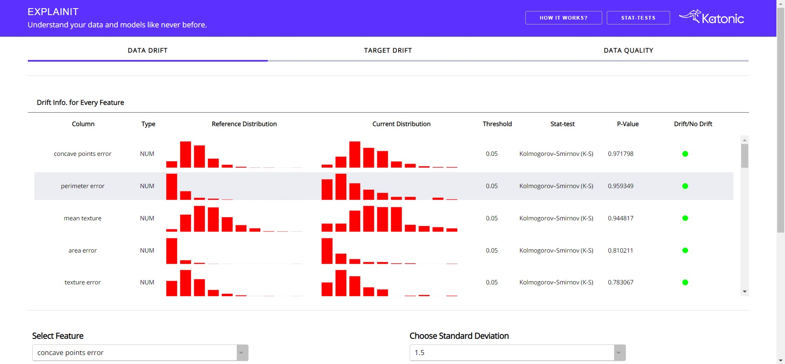

<!--
Licensed to the Apache Software Foundation (ASF) under one
or more contributor license agreements.  See the NOTICE file
distributed with this work for additional information
regarding copyright ownership.  The ASF licenses this file
to you under the Apache License, Version 2.0 (the
"License"); you may not use this file except in compliance
with the License.  You may obtain a copy of the License at

  http://www.apache.org/licenses/LICENSE-2.0

Unless required by applicable law or agreed to in writing,
software distributed under the License is distributed on an
"AS IS" BASIS, WITHOUT WARRANTIES OR CONDITIONS OF ANY
KIND, either express or implied.  See the License for the
specific language governing permissions and limitations
under the License.
-->

# Explainit

<p align="center">
    <a href="https://katonic.ai/">
      
    </a>
</p>
<br />

[](https://opensource.org/licenses/Apache-2.0)
[](https://pypi.python.org/pypi/explainit)
[](https://pypi.python.org/pypi/explaintit)
[](https://docs.katonic.ai/)

## What is Model Drift?
Model Drift (also known as model decay) refers to the degradation of a model’s prediction power due to changes in the environment, and thus the relationships between variables.

Detects changes in feature distribution. Data Quality: provides the feature overview.

## Types of Model Drift
There are three main types of model drift:

- Concept drift
- Data drift
- Upstream data changes

***Concept drift*** is a type of model drift where the properties of the dependent variable changes. The fraudulent model above is an example of concept drift, where the classification of what is ‘fraudulent’ changes.

***Data drift*** is a type of model drift where the properties of the independent variable(s) change(s). Examples of data drift include changes in the data due to seasonality, changes in consumer preferences, the addition of new products, etc…

***Upstream data changes*** refer to operational data changes in the data pipeline. An example of this is when a feature is no longer being generated, resulting in missing values. Another example is a change in measurement (eg. miles to kilometers).

## Installation guide
```commandline
$ pip install explainit
```
## Run the App

In order to generate the dashboards inside the application, you need to run the following commands.
```python
from explainit.app import build
```

Apart from importing the methods, we need some data that should be passed to the application in order to generate the dashboards.
We'll use the toy datasets that are available in scikit-learn library.

```python
import pandas as pd
from sklearn import datasets
from sklearn.model_selection import train_test_split

cancer_data = datasets.load_breast_cancer()
cancer_dataframe = pd.DataFrame(cancer_data.data, columns = cancer_data.feature_names)
cancer_dataframe['target'] = cancer_data.target
ref_data, cur_data = train_test_split(cancer_dataframe, train_size=0.80, shuffle=True)
```

Once you prepared the both training and testing datasets, all you need to do is pass those datasets into the method that we imported along with the target column name and target column type (type should be `cat` for categorical column and `num` for numerical columns).

```python
build(
  ref_data=ref_data,
  cur_data=cur_data,
  target_column_name="target",
  target_column_type="cat",
  host="127.0.0.1",
  port=8050
)
```

If you want to run your application in a separate server rather than localhost, you need to mention the host and port addresses.

## App Snapshots
Below is a snapshot of the landing page of Explainit Dashboard.

<p align="center">
      
</p>
<br />

## QnA

### Q. What exactly the scope of the app is?
A. By this app users can calculate Dataset Drift, Target Drift and Data Quality metrics to understand the Production / Real-World Data along with Training / Reference Data better to come to a decision.

### Q. What does the input data look like?
A. Input Data is nothing but your training and testing data. The training data will be used for the distribution comparision for the testing data. These input data should be passed as pandas dataframes.

### Q. What outputs does the app produce?
A. App shows / produces the Statistical Information about the complete data (features + target) for drift analysis, Distribution Plots for each of the features to understand the data better, Contribution of each features on the target along with Correlations metrics.

### Q. What decisions can the user make by using the app?
A. With Drift Information from the app user can make some decisions:
> * Look for the quality data for the usecase.
> * Make changes or train new models for production.
> * Update the domain specific concepts to understand the real-world better for new models.
