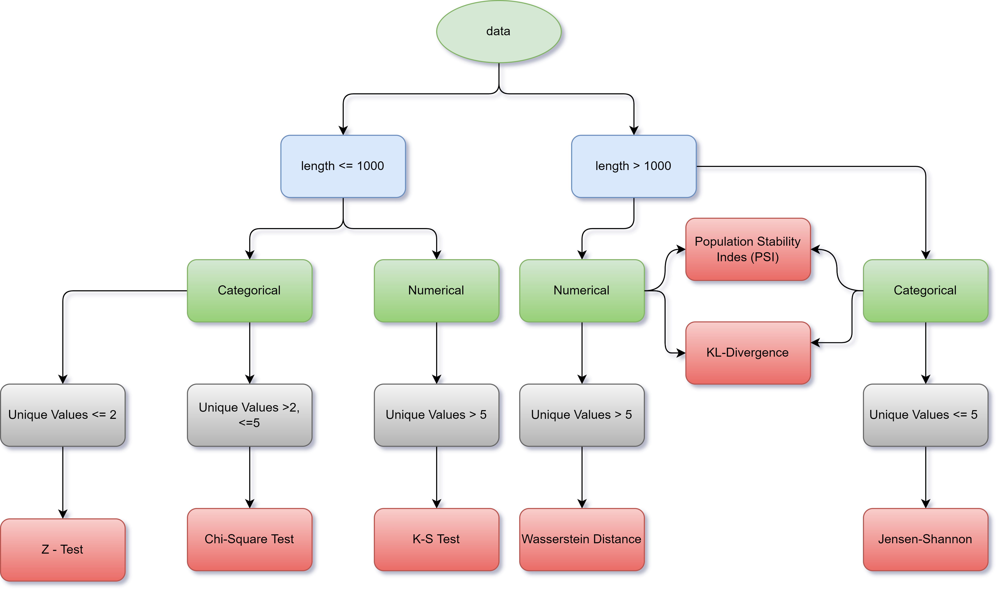

# FAQs

**Q1. How to run the Application?**

**A**: In order to run the application you need install the library from the [PyPI](https://pypi.org/project/explainit/).
```python
$ pip install explainit
```
Once you completed the installation process, import the method in order to run the application.
```python
from explainit.app import build
```
Explainit requires several parameters to be passed to the function in order to run the application.
 - `reference_data`: The data on which your machine learning model will get trained (training data).
 - `production_data`: The data for which you need the predictions from the model (production data).
 - `target_col_name`: The dependent column name from your dataset.
 - `target_col_type`: What type of category that the target column is, use `cat` if your target column is a categorical or use `num` for continuous column.
 - `datetime_col_name`: Optional datetime column name present in the `reference` & `production` data.
 - `host`: Optional host address where you want this application to run, in string format (default: 0.0.0.0 or localhost).
 - `port`: Optional port where you want this application to run, in integer format (default: 8050).

Once you define the parameters for the Explainit, simply run the function in order to start the application.
```python
build(reference_data, production_data, target_col_name, target_col_type, datetime_col_name, host, port)
```

**Q2. How to decide the Statistical-tests and their significance?**

**A**: Statistical tests are used in drift detection. They can be used to:

 - Determine whether a predictor variable has a statistically significant relationship with an outcome variable. Estimate the difference between two or more groups.
 - Statistical tests assume a null hypothesis of no relationship or no difference between groups. Then they determine whether the observed data fall outside of the range of values predicted by the null hypothesis.

If you already know what types of variables you’re dealing with, you can use the flowchart to choose the right statistical test for your data.
<p align="center">
    
</p>
<br />

**Q3. How do you defined the thresholds?**

**A**: The significance threshold is chosen during the planning of an *A/B test* and it corresponds to the probability of committing a type I error (registering a false positive) which is deemed acceptable under the specific circumstances of the test in question. The threshold is used to compute the sample size needed for a uniformly most powerful test at that threshold and specified minimum effect of interest and statistical power against a composite hypothesis with a lower bound at the MEI.

After the test is completed, the *observed p-value is compared to the threshold* and if it is lower the null hypothesis is rejected.

The significance threshold is often set to 0.05 (equivalent to 5% *confidence level*) but when choosing the significance threshold for a particular test one should ideally consider the particular risks and rewards associated with the test at hand. A test for a major decisions which has wide-ranging consequences and is hard to reverse might require a very high evidential threshold, say 0.001. On the other hand, a different test in which the decision has limited scope and is easy to reverse if necessary can be planned with a much higher threshold (lower evidential input) of 0.1. *Sample size* and test duration considerations also enter into account.

A particular value of the significance threshold is usually denoted in formulas as c(α) where α is alpha and the "c" comes from another term which is often used in statistical literature: critical region.

**Q4. Supported types for using Explainit?**

**A**: Currently, Explainit supports:
- [Pandas](https://pandas.pydata.org/) Dataframe. Which is used by enormous number of data scientists in order to manipulate the data.

**Q5. Decisions that we can take from the Application?**

**A**: With Drift Information from the app user can make some decisions:
 - Look for the quality data for the usecase.
 - Make changes or train new models for production.
 - Update the domain specific concepts to understand the real-world better for new models.

**Q6. The DataFrame format should be followed?**

**A**: The dataframe dosen't need to be any specific format. You can use it as it is. Just make sure that both the dataframes contains same columns in order to find the comparision between two dataframes.

**Q7. Topics that are gonna covered using the Application?**

**A**: This Application majorly revolves around 3 main topics:
 - Data Drift: Data-drift is defined as a variation in the production data from the data that was used to test and validate the model before deploying it in production.
 - Concept Drift: In machine learning, predictive modeling, and data mining, concept drift is the gradual change in the relationships between input data and output data in the underlying problem. The ‘concept’ in question is the unknown and hidden relationship between input and output variables.
 - Data Quality: Data quality indicates how reliable a given dataset is. The data’s quality will affect the user’s ability to make accurate decisions regarding the subject of their study. For example, if the data is collected from incongruous sources at varying times, it may not actually function as a good indicator for planning and decision-making.

High-quality data is collected and analyzed using a strict set of guidelines that ensure consistency and accuracy. Meanwhile, lower-quality data often does not track all of the affecting variables or has a high-degree of error.
