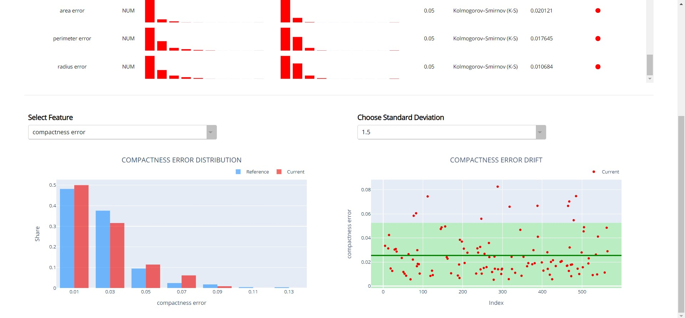
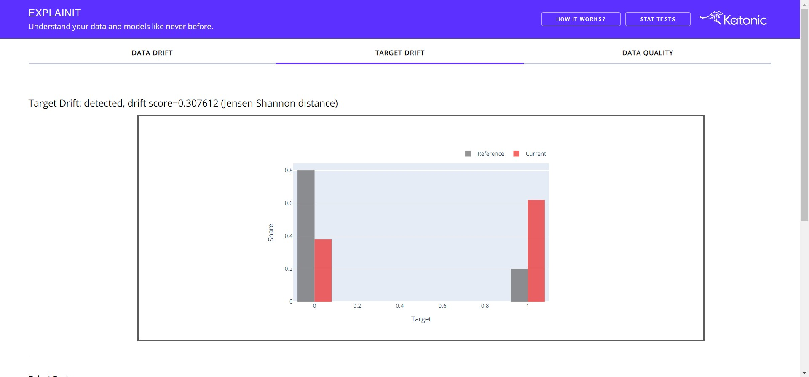
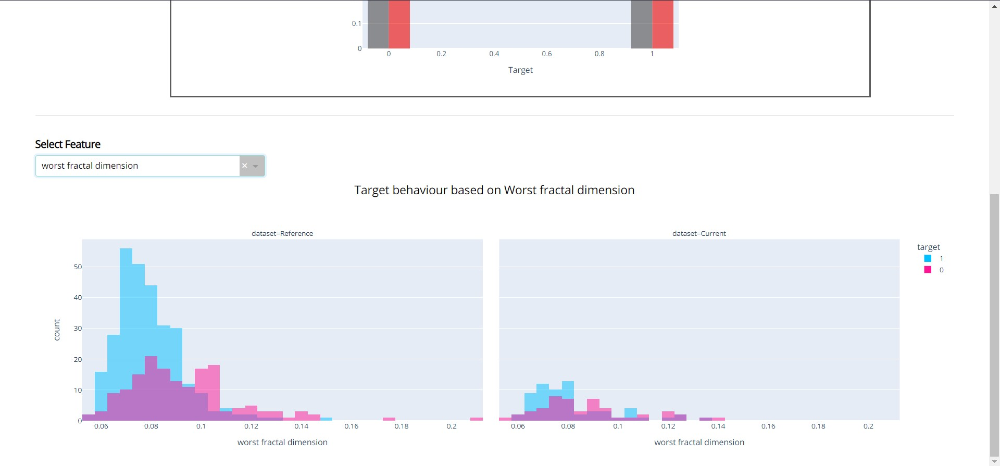
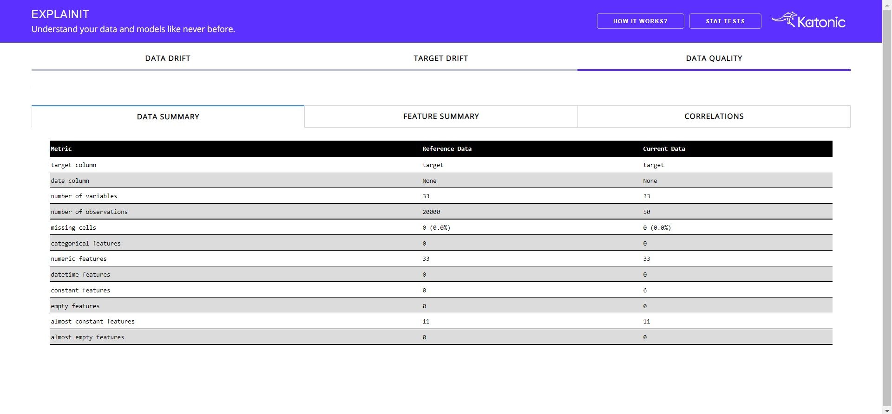
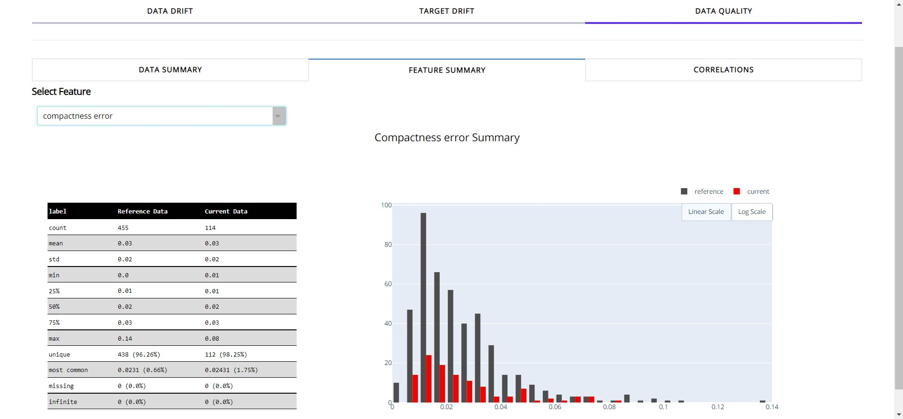
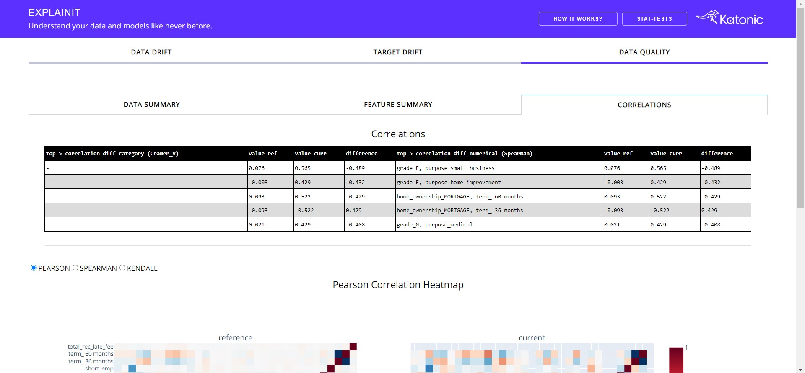
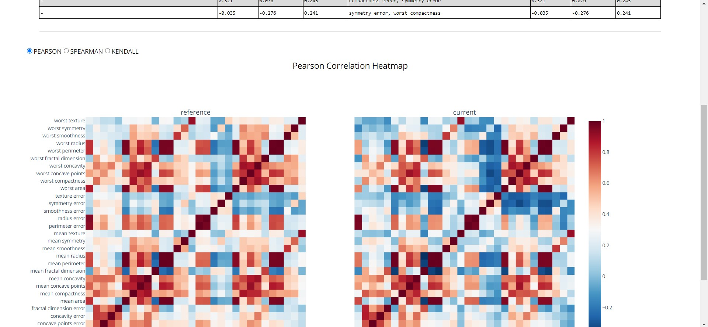

# Getting Started with Explainit

Explainit is a python library which provides dashboards and statistical information about the data drift, target drift and data quality.

In this getting started guide, we will explore the Explainit library and use it to evaluate the drift inside the data.

In order to use the Explainit library, we suggest you to go through the complete guide and understand the funcctionalities.

You need basic knowledge of Python, [Pandas](https://pandas.pydata.org/docs/) and data preprocessing steps.

In this getting started, you will accomplish the following things:

# 1. Install Explainit
To install the explainit library you need to run the following command in terminal or Notebook cell.

```commandline
$ pip install explainit
```

Install scikit-learn for example dataset.
```commandline
$ pip install scikit-learn
```

These dashboards are build on top of Python Dash, So you'll see them inside your browser on the host and port you provided while initializing the Dashboards.

# 2. Import Explainit
Once you installed the Library, you'll need to import the functionalities inside your work environment i.e, python .py file or Jupyter Notebook.
```python
import pandas as pd
from sklearn import datasets

from explainit.app import build
```
Once you imported the required libraries, you need to preprocess the data in a format so that it'll get suited with the library.

# 3. Data Preparation.
```python
cancer_data = datasets.load_breast_cancer()
cancer_dataframe = pd.DataFrame(cancer_data.data, columns = cancer_data.feature_names)
cancer_dataframe['target'] = iris.target
ref_data, cur_data = train_test_split(cancer_dataframe, train_size=0.80, shuffle=True)
```

You need to pass two dataframes in order to analyze the drift inside your data. First dataframe is used for the reference which is nothing but the data that you'll use for model training. The second dataframe is your production data on which you want to perform the drift and quality analysis.

In the above code, we divided the entire dataframe into set separate dataframes with the ratio of 80:20. The reference data has 80% of the entire data and productions have 20% of the data.

Apart from the two dataframes, we also need couple of parameters you need to pass to the function in order to generate the Dashboards. Which are nothing but the target type which is nothing but whether the target column inside the data lies under categorical or numerical. If it is a categorical, then you need to pass "cat" as target_col_type in the function or "num" if it is a numerical. Along with that, you need to pass the column name also.

You can add your custom host id and port to the function in order to run the application on different locations.

# 4.Generate Dashboards.
In order to Initialize the dash application, you need to pass following parameters in `build` function:
- `reference_data`: Reference dataset (pandas dataframe)
- `production_data`: Production dataset (pandas dataframe)
- `target_col_name`: Target column name
- `target_col_type`: Target column nype (`"num"`: Numerical or `"cat"`: Categorical)
- `datetime_col_name`: Optional datetime column name (default: None)
- `host`: Optional host address where you want to deploy/run the app eg: `"127.0.0.1"` or `"localhost"` (default: `"0.0.0.0"`)
- `port`: Optional port where you want to deploy/run the app eg: `"8000"` (default: `"8050"`)

```python
build(
    reference_data=ref_data,
    production_data=cur_data,
    target_col_name="target",
    target_col_type="cat",
    host='127.0.0.1',
    port='8000'
)
```
Once you run the above cell you'll get to see the following output.

```bash
Initiating Explainit App...
Dash is running on http://127.0.0.1:8000/

 * Serving Flask app "explainit.app" (lazy loading)
 * Environment: production
   WARNING: This is a development server. Do not use it in a production deployment.
   Use a production WSGI server instead.
 * Debug mode: off
```
Once your application is up and running. Go to the location that you've provided while running the app, go to localhost if you've not specified any host or port.

## Initial Application interface:


You'll get to see three tabs inside the opening interface. The default tab will be data drift.

The above section will gives you the Statistical information regarding the Production data in comparision with the reference data.

Following can be found in the above section:

* Column name: Name of the column from the dataframe.
* Type: what type of column it is.
* Reference Distribution: Distribution of the column from the reference data.
* Current Distribution: Distribution of the column from the production data.
* Threshold: Threshold of the Statistical test.
* Stat-test: The statistical test, that used to analyze the drift.
* P-Value: Result metric of the Statistics test.
* Drift/No Drift: An indicator which will differentiate between whether drift detected or not for that particular column.

## Column Drift and Distritution along with the Standard Deviation.


Choose the desired column and the standard deviation from the dropdowns, In order to visualize the Distribution and Drift in comparision with reference data.

In the Drift Garph (Right Graph) will helps you understand the production data distribution. Red coloured points are the production data points, light green coloured area is the range of your reference data and the dark green line is the median of your reference data.

More the Red colured points are outside the light green area, that much drift is existed in your production data.


## Target Drift.


This tab gives a bried understanding of the target column. The heading informs whether drift occurs in target column along with the statistical test and p-value.

Apart from the target graph, you'll get to see how the target column is behaving with respect to the individual feature.
Choose the feature from the Dropdown.


## Data Quality.
The Data Quality tab contains three sub-tabs consisting of the data summary, feature summary and correlation analysis. The default tab will be Data Summary.


Data Summary helps you understand the basic statistical information regarding your reference and production data. It contains information like total count, missing observations, number of numerical features, number of empty features, etc.

When you choose the feature summary tab:


Feature Summary provides the insights about the individual feature. You need to select the feature from dropdown in order to choose the desired feature.

It provides count, number of unique values(with the ratio), most common value and missing values. Apart from basic info you can see a detailed distribution of feature for both reference and production data.

Correlation tab:


This tab provides the correlation between the feature along with the top 5 correlated features along with the difference.

Apart from the correlation table, there will be correlation heatmaps in three different correlation methods i.e, Pearson, Spearman and Kendall.

Choose the desired correlation method from the radio buttons.

